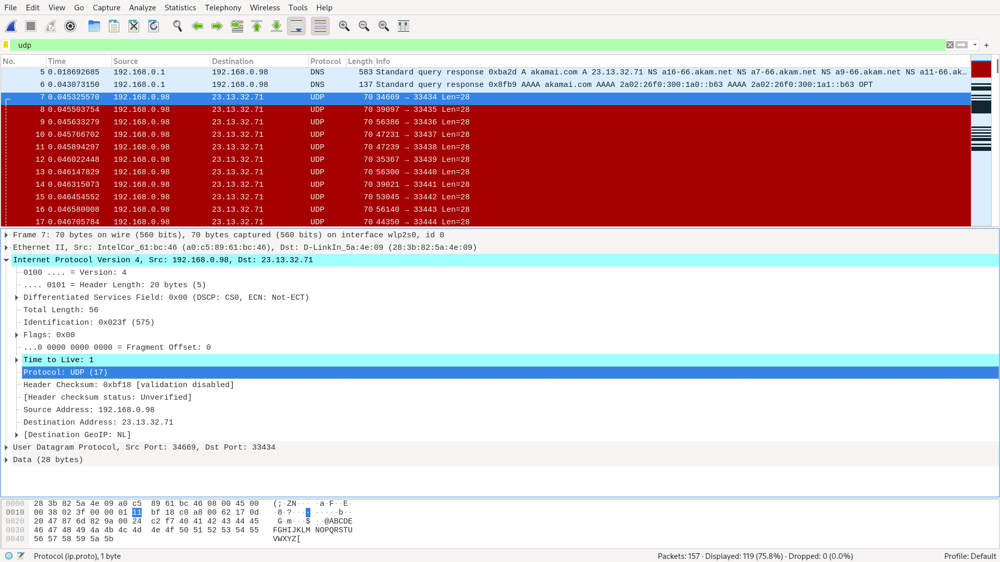
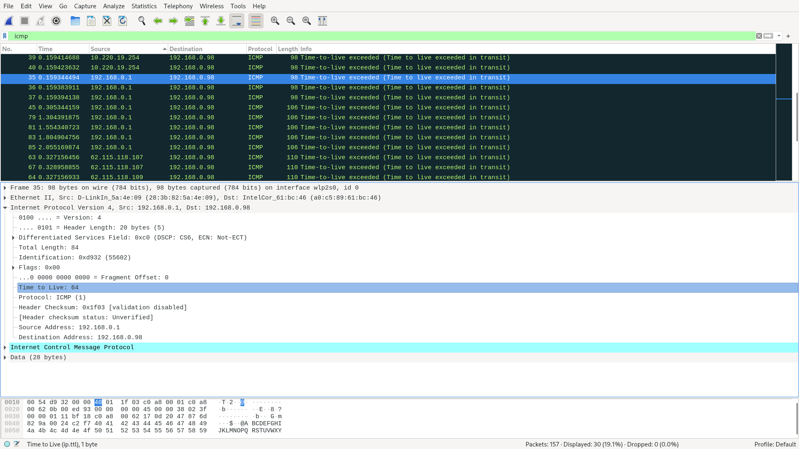
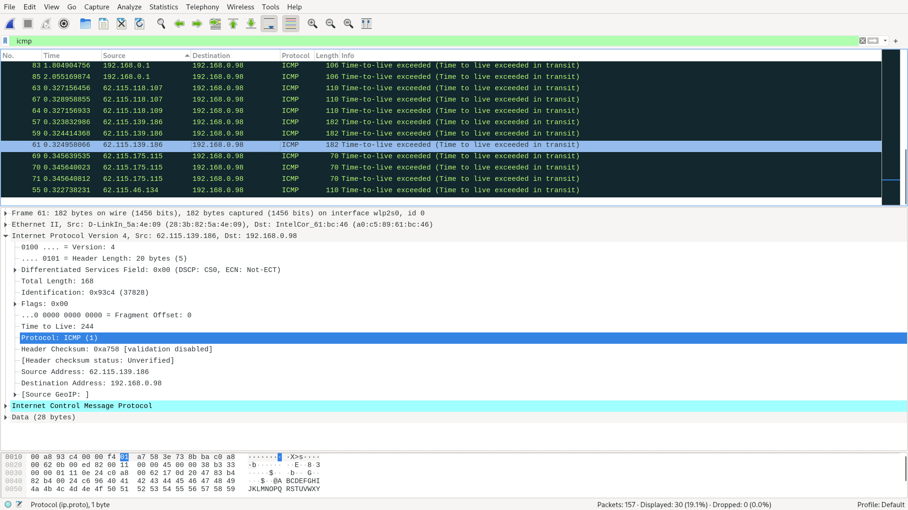
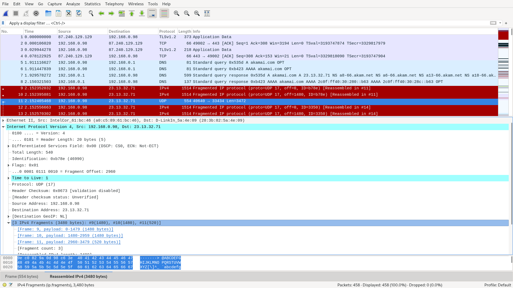
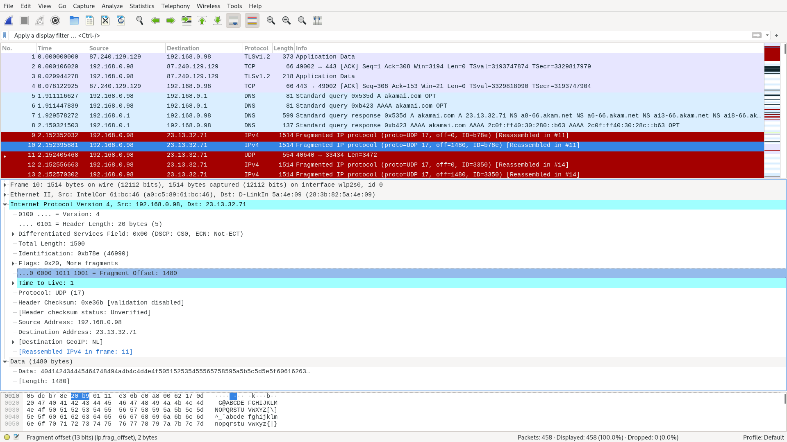

# Лабораторная работа #10
*Автор: Харгелия Сергей*

## Wireshark: IP

1. 192.168.0.98 (поле Source Address)
2. UDP (17) (поле Protocol)
3. В IP-заголовке 20 байт (поле Header Length). Так как общий размер IP-дейтаграммы равен 56 байт, то на полезную нагрузку приходится 36 байт 
4. 
a. Меняются значения в полях Identification, Header Checksum и Time to Live (это поле меняется не всегда, а раз в X дейтаграмм, где X зависит от параметров, передаваемых traceroute, по умолчанию это значение равно трём)
b. Не меняются поля Version, Header Length, Differentiated Services Field, Total Length, Flags, Protocol, Source Address, Destination Address.
c. Последовательность значений Identification начинается так: 575, 3861, 40790, 10846, 62391, 2505, 55205. Разглядеть закономерность не получилось. 

5. В поле Identification содержится значение 0x023f (575), а в поле Time to Live стоит единица. 

6. TTL во всех таких сообщениях равен 64; Identification же увеличивается на единицу с каждым следующим сообщением.

7. В поле Identification содержится значение 0x93c4 (37828), а в поле Time to Live стоит 244.

8. 
a. Ответы не фрагментируются, фрагментируются эхо-запросы, отправленные с моего компьютера (в дальнейшем буду считать, что в задании имелось в виду это). Было создано три фрагмента.
b. Изменяется значение поля Fragment Offset и, возможно, Total Length (если данные не поделились поровну и в последнем фрагменте их оказалось меньше)