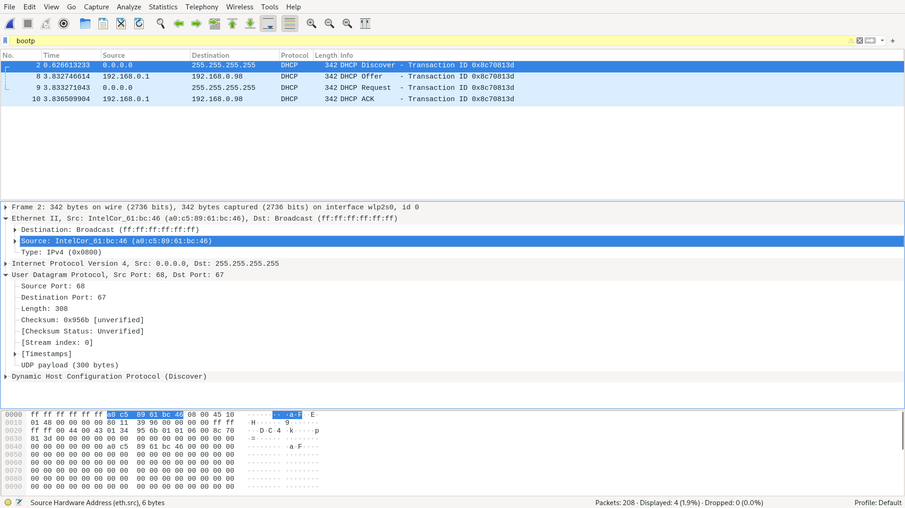
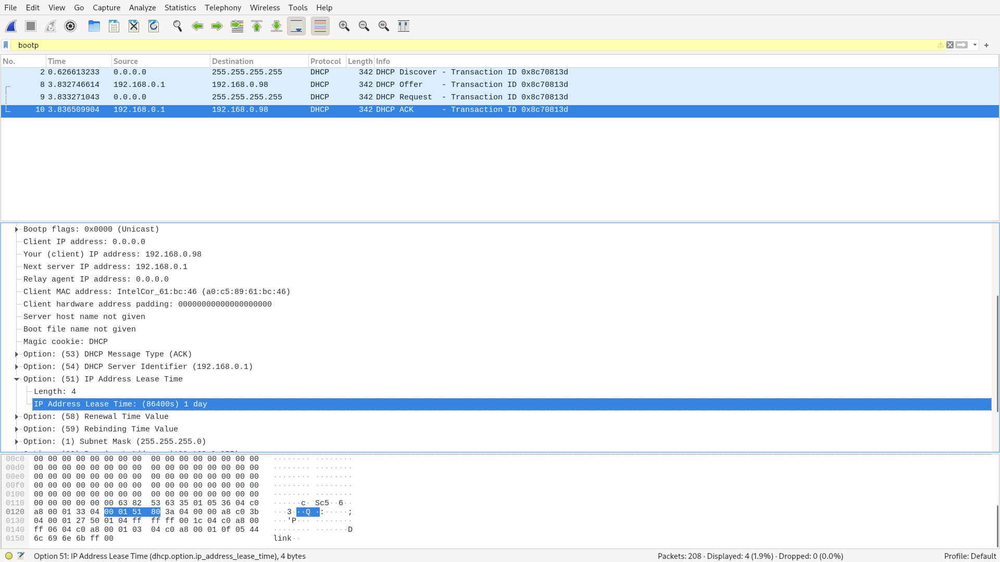

# Лабораторная работа #13
*Автор: Харгелия Сергей*

## Wireshark: DHCP

1. DHCP сообщения посылаются поверх протокола UDP
2. a0:c5:89:61:bc:46
3. Во всех сообщениях Transaction ID = 0x8c70813d, это поле требуется для того, чтобы хост мог понимать, что ответ пришёл на нужный запрос
4. В запросе исходный адрес 0.0.0.0 (дефолтный), конечный 255.255.255.255 (то есть запрос отправляется всем хостам в сети, чтобы найти DHCP-сервер); в ответе исходный адрес 192.168.0.1 (адрес DHCP-сервера), конечный 192.168.0.98 (выданный IP-адрес)
5. 192.168.0.1

6. IP-адреса выдаются хостам на определённый срок для того, чтобы их можно было переиспользовать (например, если один из хостов больше не используется, его IP-адрес может быть выдан кому-то другому). В моём случае длительность срока аренды одни сутки

## Теоретические задачи

Решения задач находятся в файле [theory.pdf](theory.pdf)
