# Лабораторная работа #4
*Автор: Харгелия Сергей*

## Wireshark. Работа с DNS

### Утилита nslookup 

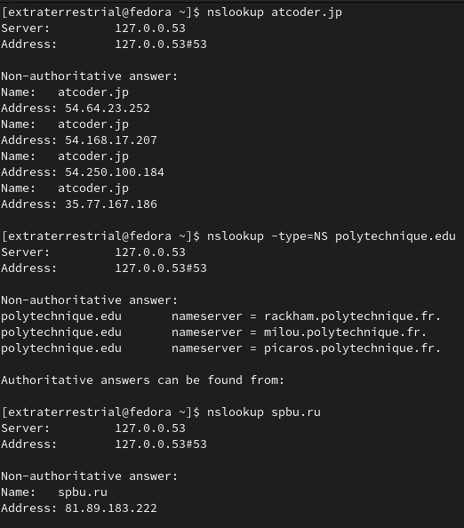

Видно, что atcoder.jp имеет несколько адресов. Веб-сервер СПбГУ имеет один IP-адрес

### DNS-трассировка www.ietf.org

1. DNS-запрос и ответ отправлены с помощью протокола UDP
2. Порт назначения 53 (поле Dst Port)
3. Запрос отправлен на адрес 192.168.0.1, это действительно адрес моего DNS-сервера.
4. Запрашивается запись типа A (Host Address); видно, что ответов в запросе не содержится (например, это можно понять, посмотрев на значение Answer RRs)
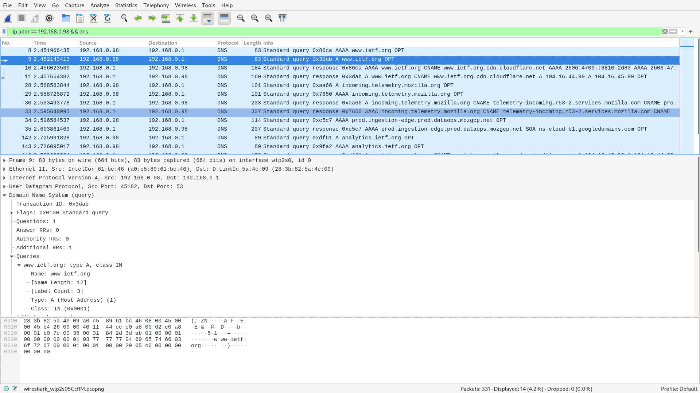
5. Три ответа, первый это запись типа CNAME (Canonical Name), которая содержит действительное доменное имя псевдонима www.ietf.org; вторая и третья записи содержат IP-адреса веб-сервера
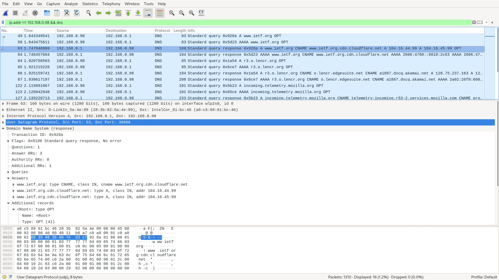
6. Да, соответствует (адрес 104.16.44.99 был среди IP-адресов ответа)
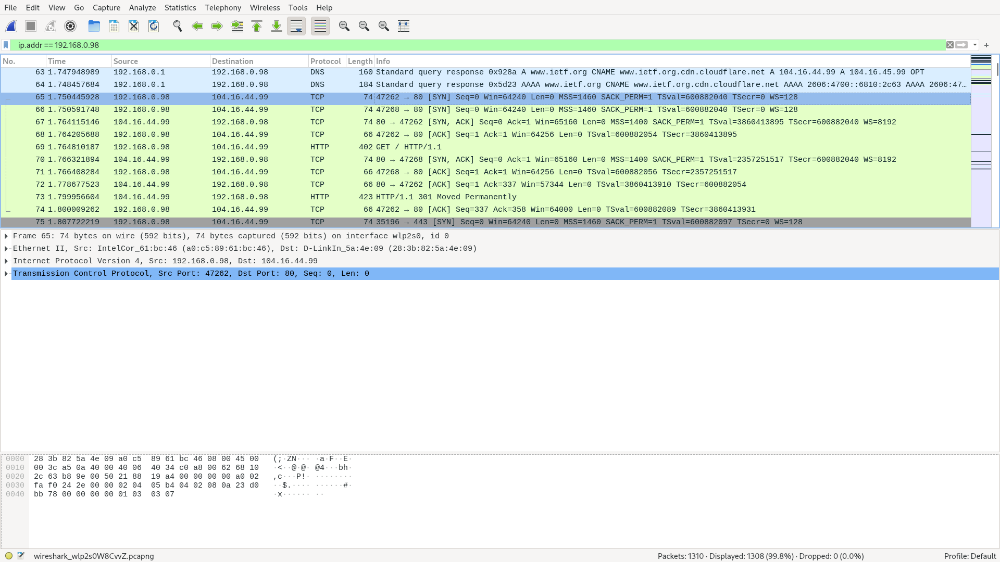
7. Какие-то ещё DNS запросы есть, но не очень понятно, для загрузки изображений они нужны или для чего-то другого

### DNS-трассировка www.spbu.ru

1. Номер порта назначения в запросе и номер порта источника в ответе равны 53.
2. Запрос отправлен на адрес 192.168.0.1, он совпадает с адресом локального DNS-сервера.
3. Запрашивается запись типа AAAA (IPv6 Address); видно, что ответов в запросе не содержится (например, это можно понять, посмотрев на значение Answer RRs)
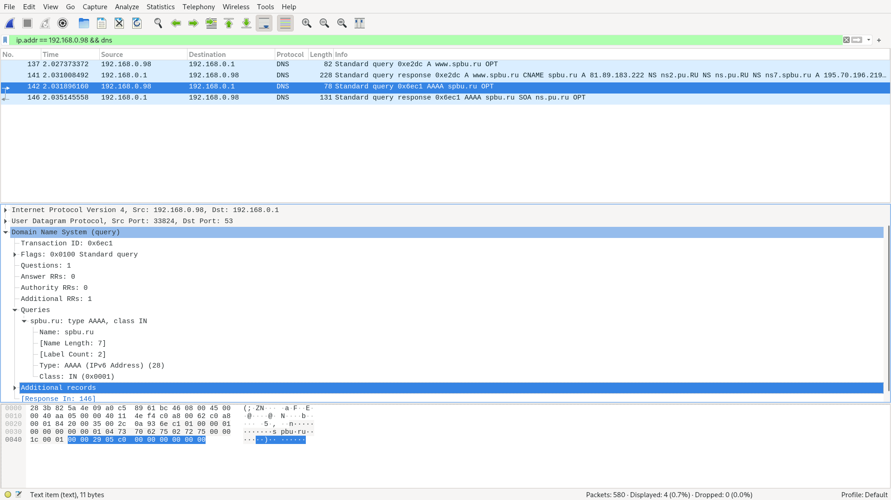
4. В ответном сообщении не содержится ни одного ответа (видимо, это обусловлено тем, что у www.spbu.ru есть только IPv4 адрес), есть только имя авторитетного DNS-сервера
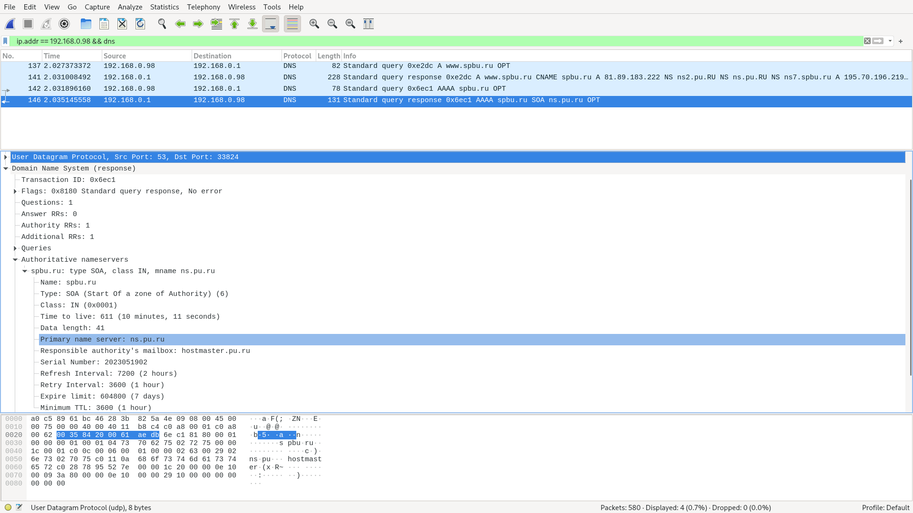

### DNS-трассировка nslookup –type=NS

1. Запрос отправлен на адрес 192.168.0.1, он совпадает с адресом локального DNS-сервера.
2. Запрашивается запись типа NS (authoritative Name Server); видно, что ответов в запросе не содержится (например, это можно понять, посмотрев на значение Answer RRs)
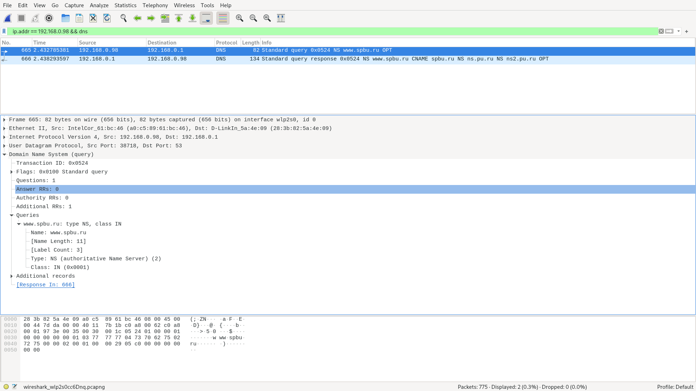
3. Три ответа, первый это запись типа CNAME (Canonical Name), которая содержит действительное доменное имя псевдонима www.spbu.ru; вторая и третья записи содержат имена авторитетных DNS-серверов университета, при этом их адресов в ответе нет.
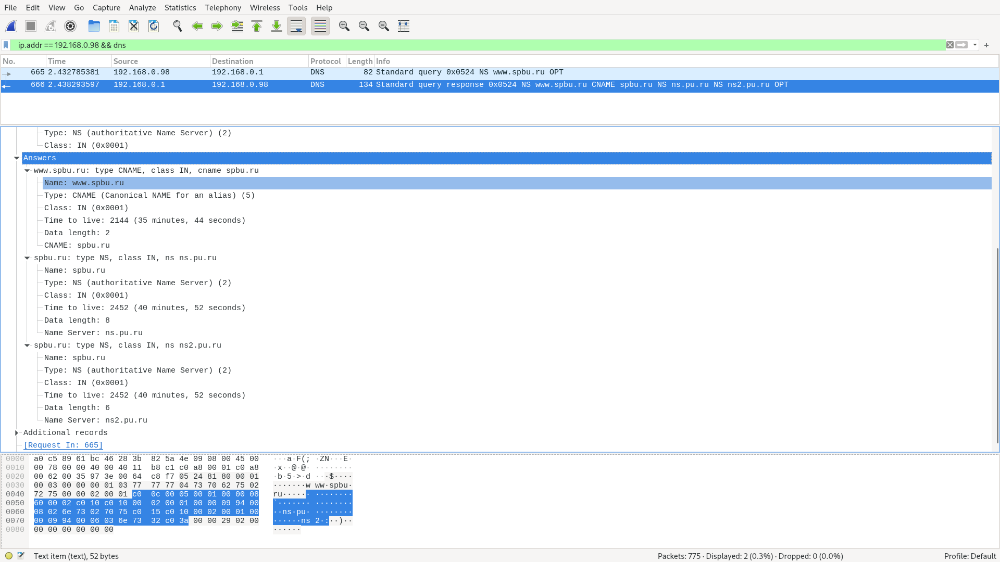

### DNS-трассировка nslookup www.spbu.ru ns2.pu.ru

1. Запрос отправлен на адрес 195.70.196.210, он не совпадает с адресом локального DNS-сервера; этот адрес принадлежит хосту ns2.pu.ru, это можно увидеть в выводе nslookup
2. Запрашивается запись типа AAAA (IPv6 Address); видно, что ответов в запросе не содержится (например, это можно понять, посмотрев на значение Answer RRs)
3. В ответном сообщении не содержится ни одного ответа (видимо, это обусловлено тем, что у www.spbu.ru есть только IPv4 адрес), есть только имя авторитетного DNS-сервера

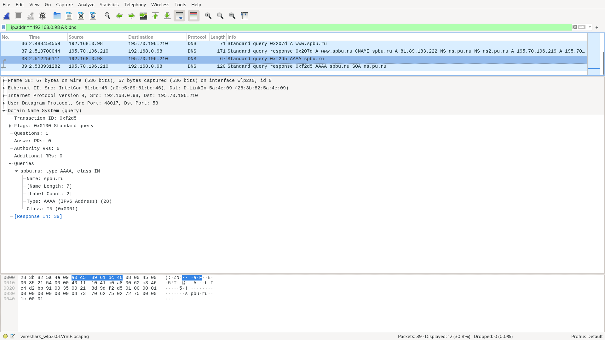
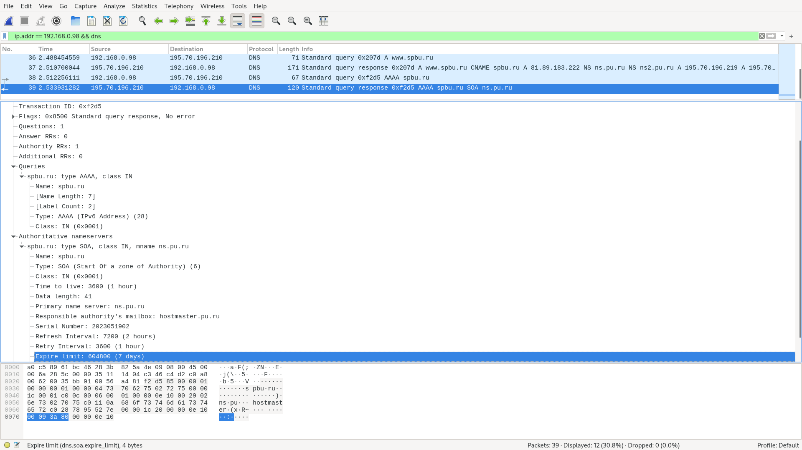
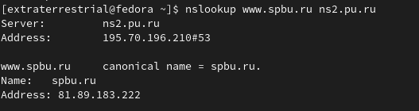

### Сервисы whois

1. Whois это сервис, который позволяет узнать основные данные о доменном имени (информация о регистраторе и администраторе сайта, срок истечения регистрации домена, DNS-сервера)
2. Используя www.whois.ru и who.is я получил имена DNS-серверов google и vk
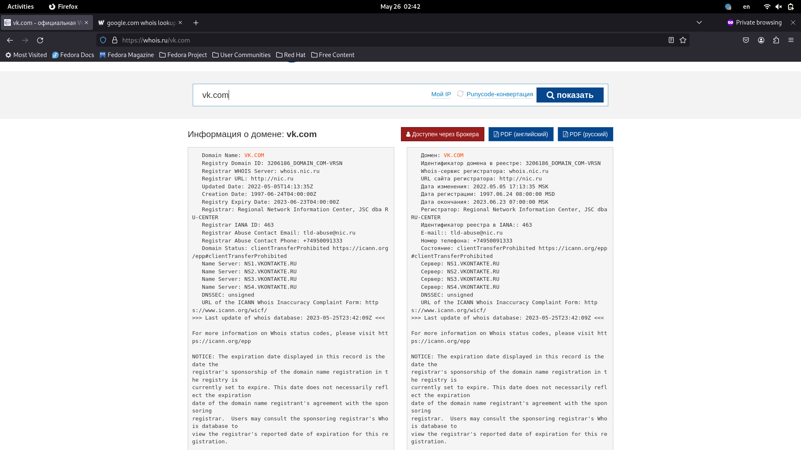
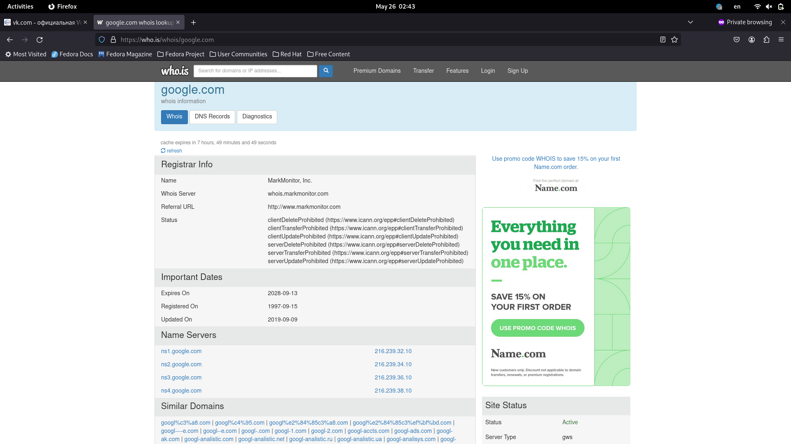
3. 
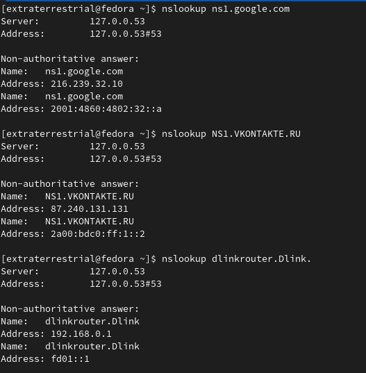