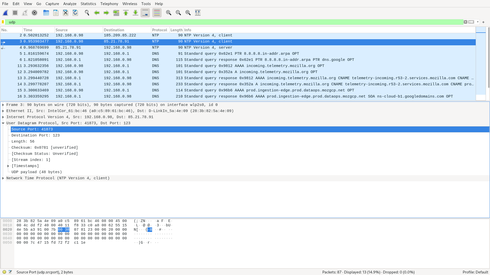
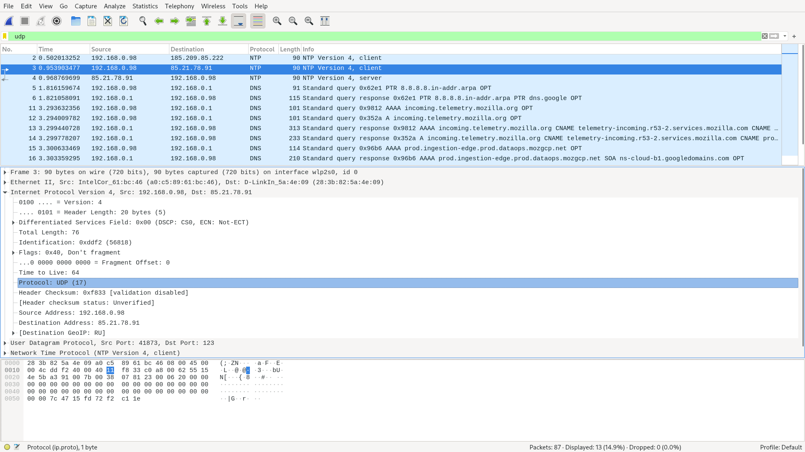
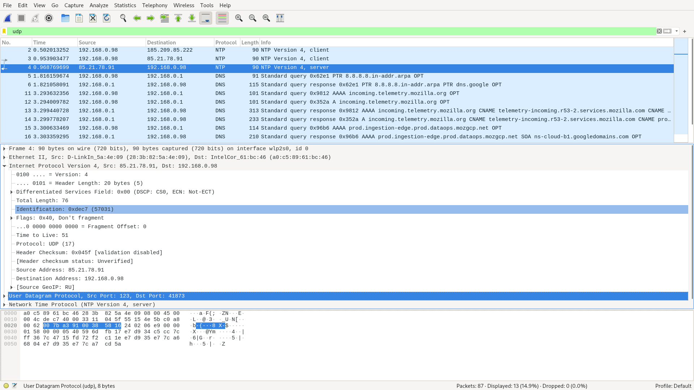

# Лабораторная работа #6
*Автор: Харгелия Сергей*

## Wireshark: UDP

1. UDP-заголовок содержит четыре поля: Source Port, Destination Port, Length и Checksum.
2. Каждое поле занимает два байта.
3. Length это размер пакета в байтах (включая заголовок), потому что ниже есть информация о UDP payload, который занимает на восемь байт меньше, чем написано в поле Length.
4. Так как Length занимает два байта, то общий размер пакета не более 65535 байт. Тогда в полезную нагрузку может быть включено не более, чем 65535 - 8 = 65527 байт.
5. Порт отправителя тоже занимает два байта, поэтому его максимальное значение 65535.
6. В десятичной системе 17, в шестнадцатеричной 11.
7. Номера портов те же самые с точностью до того, что source и destination поменяны местами. 

## FTP

### FileZilla

### FTP клиент
