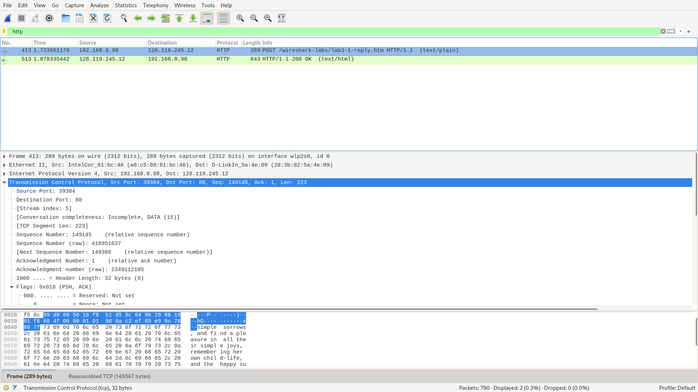
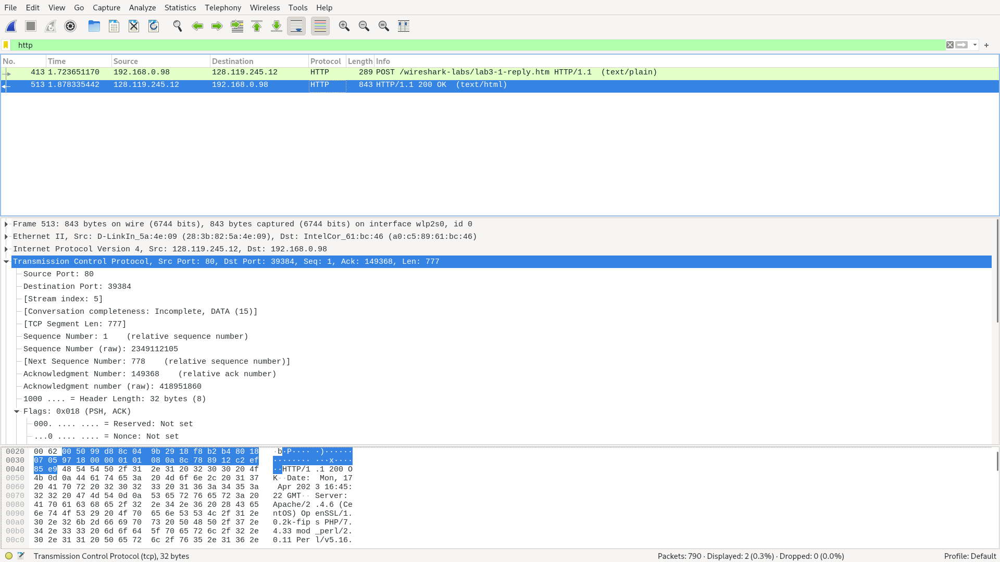
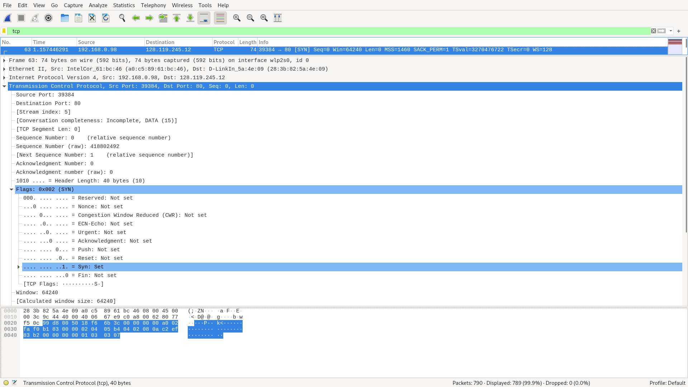
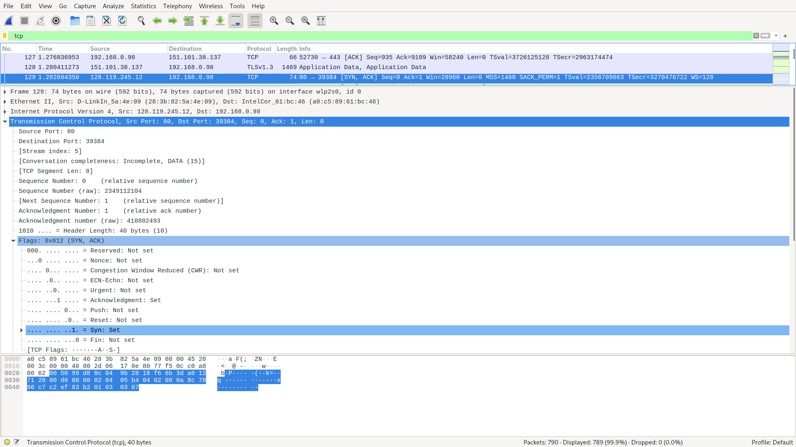
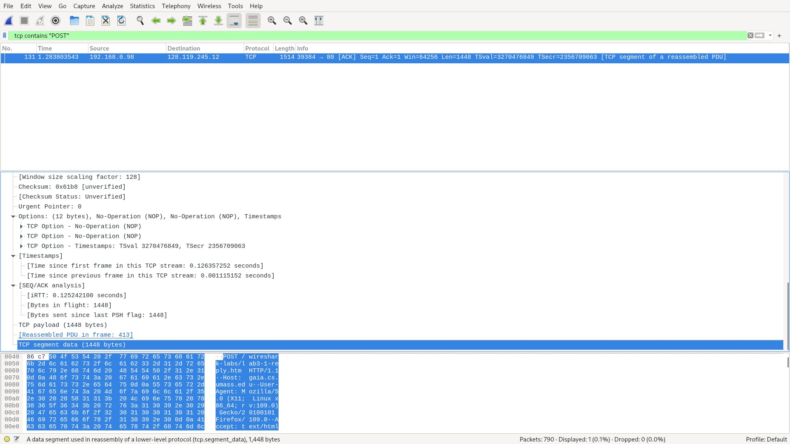
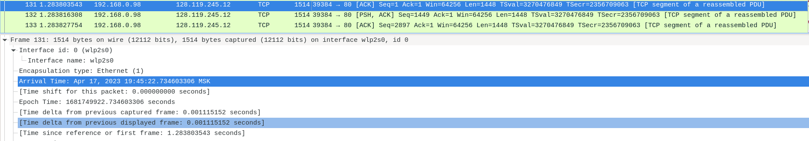
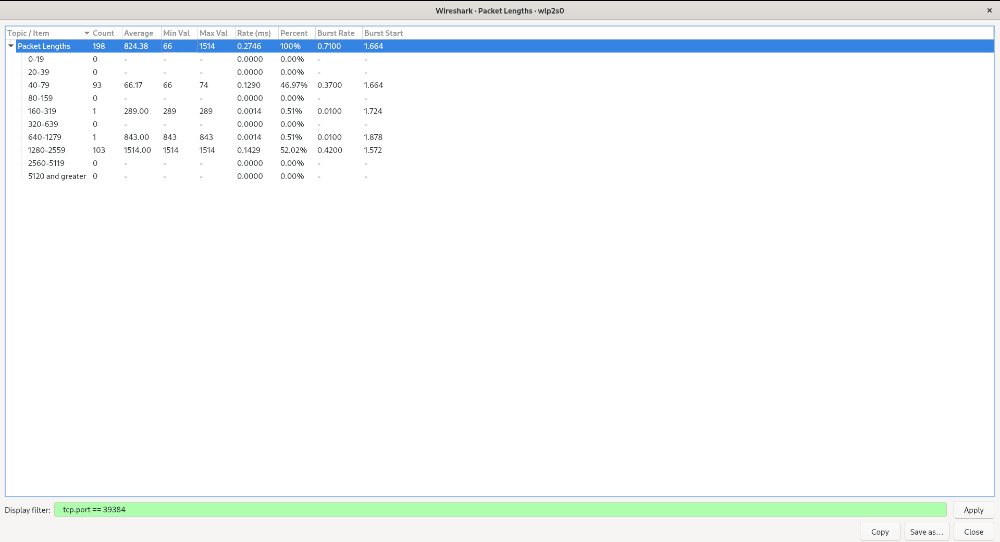
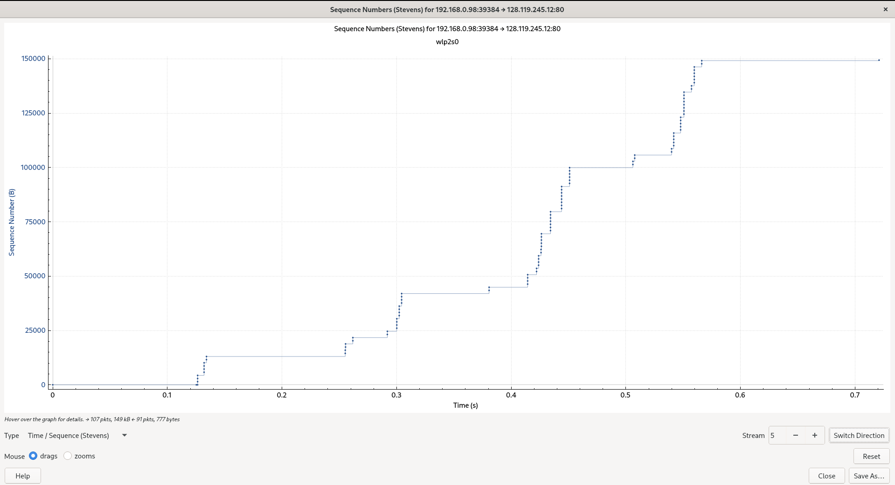

# Лабораторная работа #7
*Автор: Харгелия Сергей*

## Wireshark: TCP

1. Мой компьютер использует IP-адрес 192.168.0.98 и порт 39384
2. gaia.cs.umass.edu использует IP-адрес 128.119.245.12 и порт 80
3. Относительный порядковый номер 0, "сырой" порядковый номер 418802492. Определить, что это именно SYN сегмент можно с помощью флага SYN, выставленного в единицу. 
4. Относительный порядковый номер 0, "сырой" порядковый номер 2349112104. В поле подтверждения (ACK) хранится 1, это порядковый номер следующего байта, который сервер ожидает получить. Определить, что это именно SYNACK сегмент можно с помощью флагов SYN и ACK, выставленных в единицу.
5. Чтобы найти сегмент, давайте отфильтруем по tcp contains "POST". Относительный порядковый номер 1, "сырой" порядковый номер 418802493.
6. Порядковые номера: 1, 1449, 2897, 4345, 5793 и 7241 (чтобы это определить, нужно посмотреть на поле Seq). 
   Дальше зайдём во вкладку Frame и посмотрим на Arrival time для каждого сегмента (Arrival time это время, когда Wireshark захватил данный пакет, поэтому в  случае сегментов, которые мы отправляем на сервер, это соответствует времени отправки, а в случае ACK пакетов это соответствует времени получения):   19:45:22.734603306, 19:45:22.734616071, 19:45:22.734627517, 19:45:22.734630564,  19:45:22.740250846, 19:45:22.740261658. 

   Для ACK пакетов времена такие: 19:45:22.863352587, 19:45:22.863663641, 19:45:22.869995770, 19:45:22.869995948, 19:45:22.869996021, 19:45:22.869996068.

   Тогда получим значения RTT, равные 0.128749281, 0.129047570, 0.135368253, 0.135365384, 0.129745175, 0.129734410. Среднее значение RTT равно 0.13133501216.

7. Воспользуемся утилитой Statistics => Packet Lengths и отфильтруем по tcp.port == 39384. Увидим, что всего было передано 198 пакетов со средней длиной 824.38 байт, то есть суммарно было передано примерно 163227 байт. Дальше посмотрим на Arrival time первого и последнего tcp сегмента, они равны 19:45:22.608246054 и 19:45:23.329170926 соответственно. Тогда для того, чтобы найти пропускную способность tcp соединения, нужно поделить общее число переданных битов на время передачи, получим примерно 221 Кбайт / c

## Wireshark: работа с Time-Sequence-Graph (Stevens)

