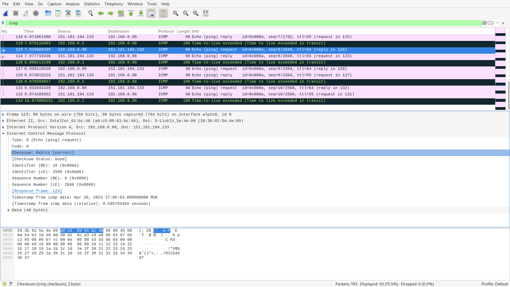
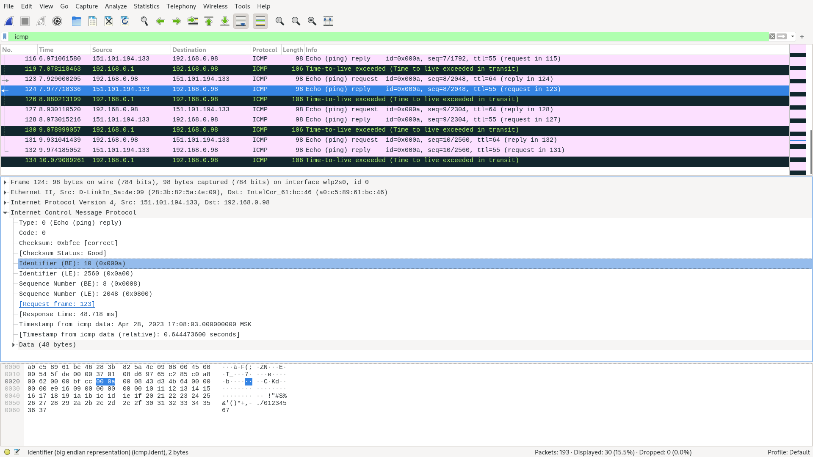
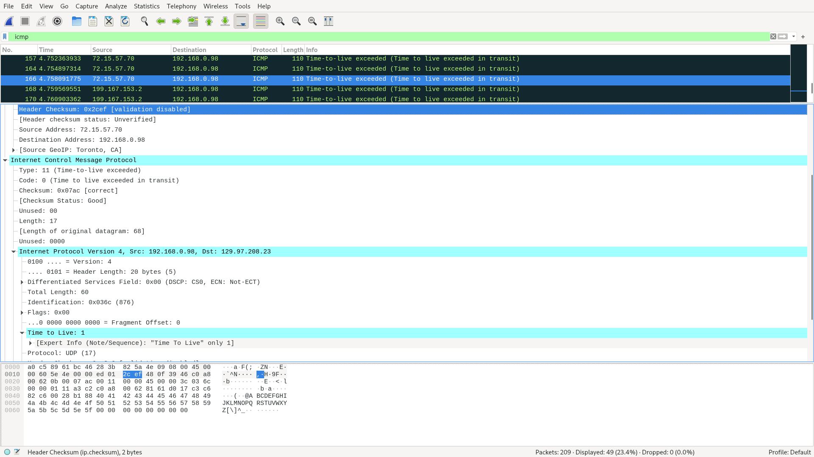
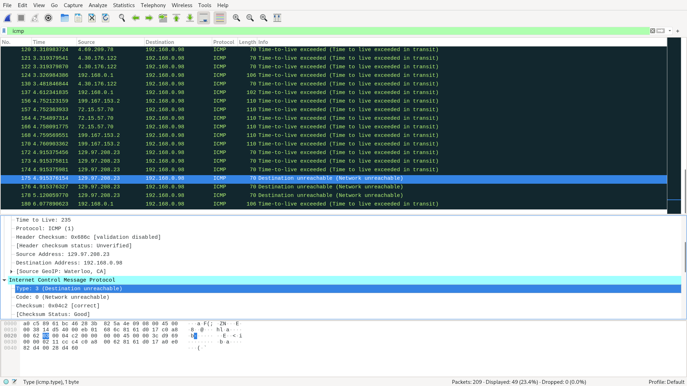
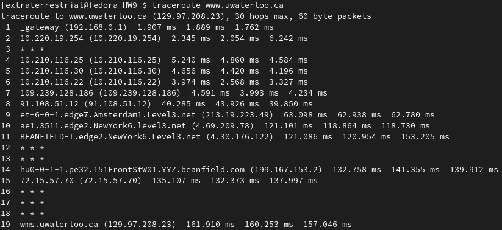

# Лабораторная работа #9
*Автор: Харгелия Сергей*

## Wireshark: ICMP

### Ping

1. IP-адрес моего хоста 192.168.0.98, IP-адрес хоста назначения 151.101.194.133
2. Потому что ICMP это протокол сетевого уровня, то есть он подразумевает общение хостов, а не процессов. 
3. Пакет имеет тип 8 (Echo (ping) request) и кодовый номер 0. Кроме этого есть поля контрольной суммы, порядкового номера и идентификатора (занимают по два байта каждое) и поле Timestamp from icmp data, занимающее восемь байт.  
4. Пакет имеет тип 0 (Echo (ping) reply) и кодовый номер 0. Поля такие же, как в прошлом пункте, и контрольная сумма, порядковый номер и идентификатор тоже занимают по два байта. 




### Traceroute

1. Тип пакета изменился на 11 (Time-to-live exceeded); добавилось поле Time to Live, а также различные вспомогательные поля (Flags и Differentiated Services Field). 
2. Самое важное добавленное поле это Time to Live. Оно нужно для того, чтобы отслеживать, сколько ещё пересылок данного пакета можно осуществить. Остальные поля выполняют вспомогательные функции и в нашем случае заполнены нулями. 

3. Последние пакеты, в отличие от предыдущих, имеют тип 3 (Destination unreachable). Это объясняется тем, что пакеты дошли до точки назначения (а не были отправлены обратно промежуточным маршрутизатором из-за истечения time to live), но, так как traceroute при отправке выбирает случайный порт, с высокой вероятностью этот порт окажется закрытым, что и произошло в нашем случае. 

4. Самая большая задержка произошла при передаче от девятого маршрутизатора к десятому, по названиям легко определить, что они находятся в Амстердаме и Нью-Йорке. 


## Программирование 

### IP-адрес и маска сети

Решение находится в файле [task1.py](programming_tasks/task1.py)

### Доступные порты

Решение находится в файле [task2.py](programming_tasks/task2.py)

Программа запускается следующим образом: 
```shell
python3 task2.py <host> <min_port> <max_port>
``` 